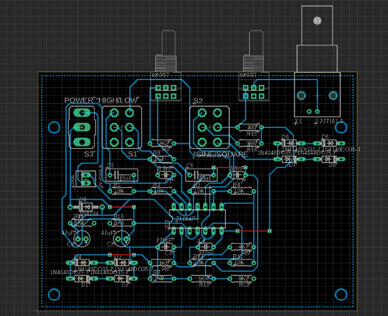

# miniosc
A DIY signal generator

## Hardware

### Design

The design is based on the Miniature Audio Oscillator of Elliot Sound Products featured on this webpage: [https://sound-au.com/project86.htm](https://sound-au.com/project86.htm)

### Schematic and PCB Layout

A new PCB is designed to include various switches, potentiometers and a BNC output connector.

[Schematic](schematic/schematic.pdf)

The board is laid out for etching on a single-side PCB with a few wire bridge on the top side.

Finished PCB

(Note: Minor modifications have been made to the first PCB prototype.)

## Operating Instructions

### Controls

Power Switch - Turns miniosc on or off
LO/HI Switch - Choose output frequency range: LO (43Hz-1kHz) or HI (735Hz-18kHz)
Frequency Knob - Adjust output frequency
Waveform Switch - Choose between square wave and sine wave output
Level Switch - Adjust output Level
Output connector - Signal output through BNC connector

### Signal output on oscilloscope

Sine wave output

Square wave Output

## Author

Alfred Shum - [ckshum88](https://github.com/ckshum88)
